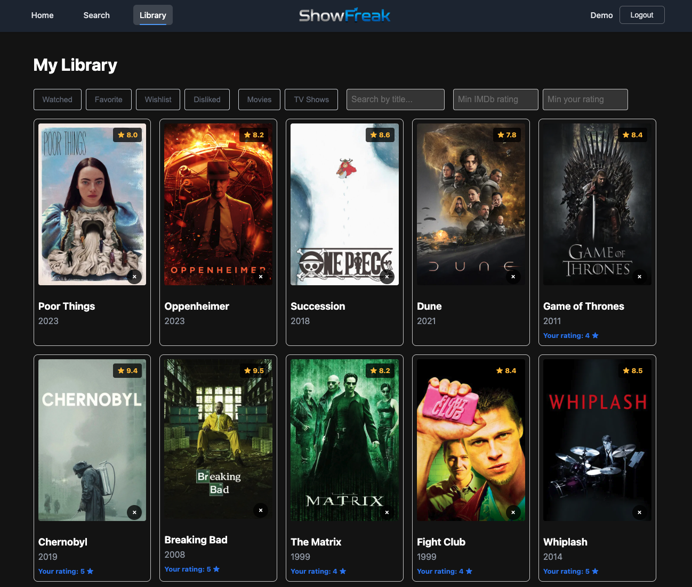

# ShowFreak

**Full-stack web application for discovering, tracking, and getting personalized recommendations for movies and TV shows.**

🔗 **[Live Demo](https://showfreak.canevarigian.dev)** — log in instantly with `demo@showfreak.com` / `demo1234`

[](https://www.typescriptlang.org/)
[](https://reactjs.org/)
[](https://nodejs.org/)
[](https://expressjs.com/)
[](https://www.postgresql.org/)
[](https://prisma.io/)

---



---

## Features

- **Smart Search** — Search movies and TV shows via TMDB API with type filtering (movie / TV)
- **Personal Library** — Track content as watched, favorite, or wishlist with personal ratings (1–5 ★) and notes
- **Filtering & Sorting** — Filter by status, genre, and content type; sort by rating, release year, or date added
- **Content-Based Recommendations** — Genre-weighted algorithm surfaces personalized suggestions based on your watch history and ratings
- **Dislike System** — Mark content you dislike to exclude it from recommendations
- **JWT Authentication** — Secure register/login with refresh token silent renewal

## Tech Stack

| Layer | Technology |
|-------|------------|
| Frontend | React 18, TypeScript, Vite, React Router v6, TanStack Query |
| Backend | Node.js 20, Express, TypeScript (ESM) |
| Database | PostgreSQL 16 + Prisma ORM |
| Auth | JWT + bcrypt, refresh token rotation |
| External API | TMDB API with local content caching |
| Logging | Pino structured logging, optional Sentry |
| Testing | Vitest — 81 backend integration tests, 25 frontend unit tests |
| Deployment | Vercel (frontend) + Render (backend) + Neon (PostgreSQL) |

## Architecture

```
src/                          # Frontend — React + Vite
├── pages/                    # Home, Search, Details, Library, Auth
├── components/               # Navbar, ContentCard, ErrorBoundary
├── hooks/                    # useLibrary, useRecommendations, usePreferences...
├── services/api.ts           # Axios instance + JWT interceptors
└── context/AuthContext.tsx   # Auth state + token management

server/                       # Backend — Node.js + Express
├── src/
│   ├── routes/               # Auth, content, library, preferences, recommendations
│   ├── controllers/          # Thin request handlers
│   ├── services/             # Business logic (auth, tmdb, library, recommendations)
│   ├── middleware/           # JWT auth, rate limiting, Helmet, CORS
│   └── lib/                  # Prisma singleton, TMDB singleton, pino logger
└── prisma/schema.prisma
```

**Key design decisions:**
- All TMDB metadata is cached in `content_cache` on first fetch — library queries never hit the external API
- Library filtering and sorting use a single JOIN query against the local cache (no N+1 queries)
- Recommendation engine weights genres from rated content (5★=3pts, 4★=2pts, 3★=1pt) and queries TMDB discover

## API

| Method | Endpoint | Description |
|--------|----------|-------------|
| POST | `/api/auth/register` | Register new user |
| POST | `/api/auth/login` | Login, returns JWT + refresh token |
| GET | `/api/auth/me` | Current user |
| GET | `/api/content/search` | Search TMDB (`?q=&type=movie\|tv`) |
| GET | `/api/content/:id` | Content details |
| GET | `/api/content/:id/similar` | Similar content |
| GET | `/api/library` | User library (`?status&genre&type&sort&q`) |
| POST | `/api/library` | Add to library |
| PATCH | `/api/library/:id` | Update rating, status, notes |
| DELETE | `/api/library/:id` | Remove from library |
| GET | `/api/preferences` | User dislikes |
| POST | `/api/preferences` | Add dislike |
| DELETE | `/api/preferences/:id` | Remove dislike |
| GET | `/api/recommendations` | Personalized recommendations |

## Getting Started

### Prerequisites

- Node.js 20+
- PostgreSQL 16+
- TMDB API key (free at [themoviedb.org](https://www.themoviedb.org/settings/api))

### Installation

```bash
git clone https://github.com/Gpiero19/ShowFreak.git
cd showfreak
npm install

# Configure environment
cp server/.env.example server/.env
# Fill in DATABASE_URL, JWT_SECRET, and TMDB_API_KEY in server/.env

# Run database migrations
cd server && npx prisma migrate deploy

# Seed demo data (optional)
npx prisma db seed

# Start both servers
cd .. && npm run dev
```

### Scripts

```bash
npm run dev             # Start frontend (:5173) + backend (:3001)
npm run build           # Build both workspaces
npm run test            # Run all tests
npm run typecheck       # TypeScript check across both workspaces
npm run lint            # ESLint across both workspaces
```

## License

MIT License — see [LICENSE](LICENSE) for details.
