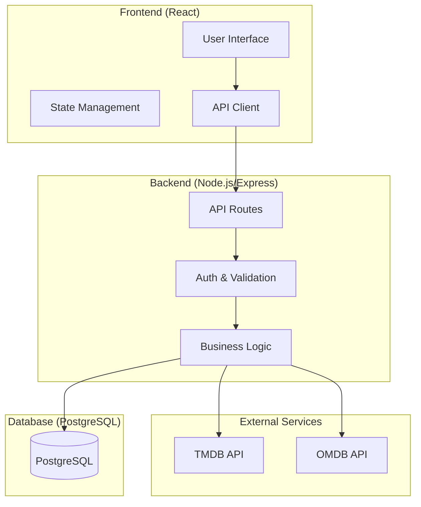
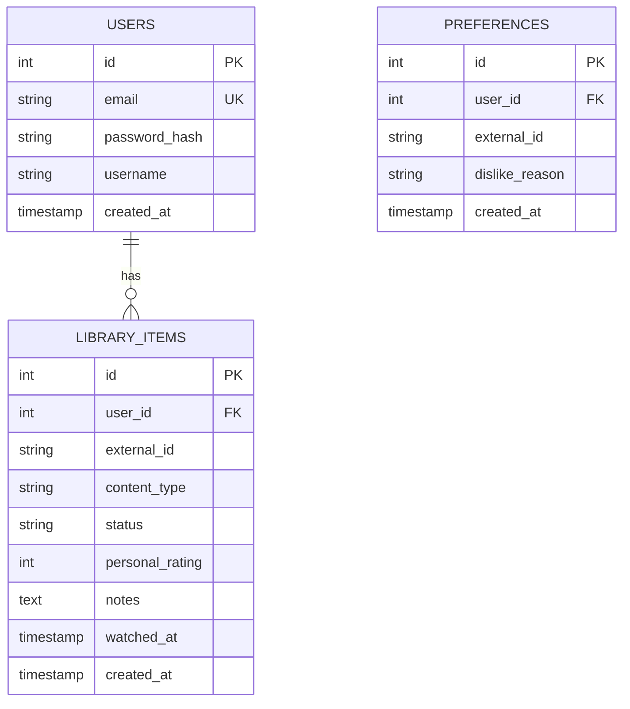
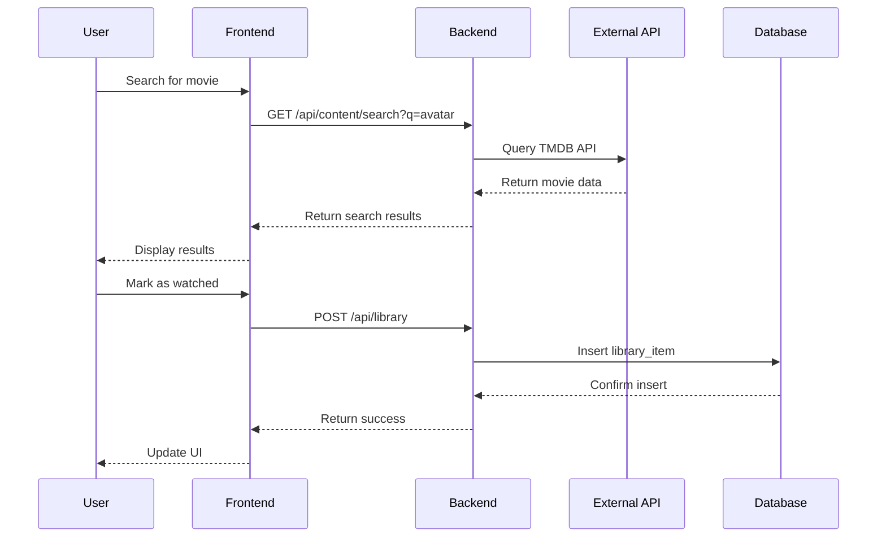

# ShowFreak - Technical Architecture

## Overview

ShowFreak is a full-stack web application for discovering, tracking, and receiving recommendations for movies and TV shows. This document outlines the technical architecture for the MVP.

---

## 1. System Architecture Diagram



---

## 2. System Components

| Component | Technology | Purpose |
|-----------|------------|---------|
| Frontend | React + Vite | User interface and interactions |
| Backend | Node.js + Express | API server and business logic |
| Database | PostgreSQL | Persistent data storage |
| External APIs | TMDB/OMDB | Movie & TV show data |
| Authentication | JWT | User session management |

---

## 3. Frontend Architecture

### Structure

```
src/
├── components/       # Reusable UI components
├── pages/            # Route pages (Home, Library, Details, etc.)
├── hooks/            # Custom React hooks
├── services/         # API client functions
├── context/          # React context for global state
├── types/            # TypeScript interfaces
└── utils/            # Helper functions
```

### Key Pages

- **Home** - Featured content and recommendations
- **Search** - Search and browse movies/TV shows
- **Details** - Individual movie/show information
- **Library** - User's watched, favorites, wishlist
- **Preferences** - User dislikes and settings

### State Management

- React Context for user session and global state
- Local component state for UI interactions

---

## 4. Backend Architecture

### Structure

```
server/
├── routes/           # API endpoint definitions
├── controllers/      # Request handlers
├── services/         # Business logic
├── models/           # Database models
├── middleware/       # Auth, validation, error handling
├── config/          # Environment configuration
└── utils/           # Helper functions
```

### API Endpoints

| Method | Endpoint | Description |
|--------|----------|-------------|
| POST | /api/auth/register | User registration |
| POST | /api/auth/login | User login |
| GET | /api/content/search | Search external content |
| GET | /api/content/:id | Get content details |
| GET | /api/library | Get user's library |
| POST | /api/library | Add item to library |
| PUT | /api/library/:id | Update library item |
| DELETE | /api/library/:id | Remove from library |
| GET | /api/recommendations | Get personalized recommendations |
| POST | /api/preferences | Set user preferences |

### External API Integration

- **TMDB (The Movie Database)** - Primary source for movie/TV data
- **OMDB** - Supplementary data (IMDb ratings)

---

## 5. Database Schema

### Entity Relationship Diagram



### Tables

#### users
| Column | Type | Constraints |
|--------|------|-------------|
| id | SERIAL | PRIMARY KEY |
| email | VARCHAR(255) | UNIQUE, NOT NULL |
| password_hash | VARCHAR(255) | NOT NULL |
| username | VARCHAR(100) | NOT NULL |
| created_at | TIMESTAMP | DEFAULT NOW() |

#### library_items
| Column | Type | Constraints |
|--------|------|-------------|
| id | SERIAL | PRIMARY KEY |
| user_id | INTEGER | FOREIGN KEY → users.id |
| external_id | VARCHAR(50) | NOT NULL |
| content_type | VARCHAR(20) | NOT NULL (movie/tv) |
| status | VARCHAR(20) | NOT NULL (watched/favorite/wishlist) |
| personal_rating | INTEGER | NULL (1-5) |
| notes | TEXT | NULL |
| watched_at | TIMESTAMP | NULL |
| created_at | TIMESTAMP | DEFAULT NOW() |

#### preferences
| Column | Type | Constraints |
|--------|------|-------------|
| id | SERIAL | PRIMARY KEY |
| user_id | INTEGER | FOREIGN KEY → users.id |
| external_id | VARCHAR(50) | NOT NULL |
| dislike_reason | VARCHAR(50) | NULL |
| created_at | TIMESTAMP | DEFAULT NOW() |

---

## 6. Data Flow



---

## 7. Technology Stack Summary

| Layer | Technology |
|-------|------------|
| Frontend | React 18, Vite, TypeScript, React Router |
| Styling | CSS Modules or Tailwind CSS |
| Backend | Node.js, Express, TypeScript |
| Database | PostgreSQL |
| ORM | Prisma or Sequelize |
| Auth | JWT (jsonwebtoken) |
| External Data | TMDB API, OMDB API |
| Deployment | Docker (optional for MVP) |

---

## 8. MVP Scope Notes

- Single user account per person
- No social features
- Simple recommendation algorithm (content-based filtering)
- No real-time notifications
- No admin dashboard (self-service only)
- External APIs for all movie/show metadata (no local content storage)

---

*Last Updated: March 2026*
