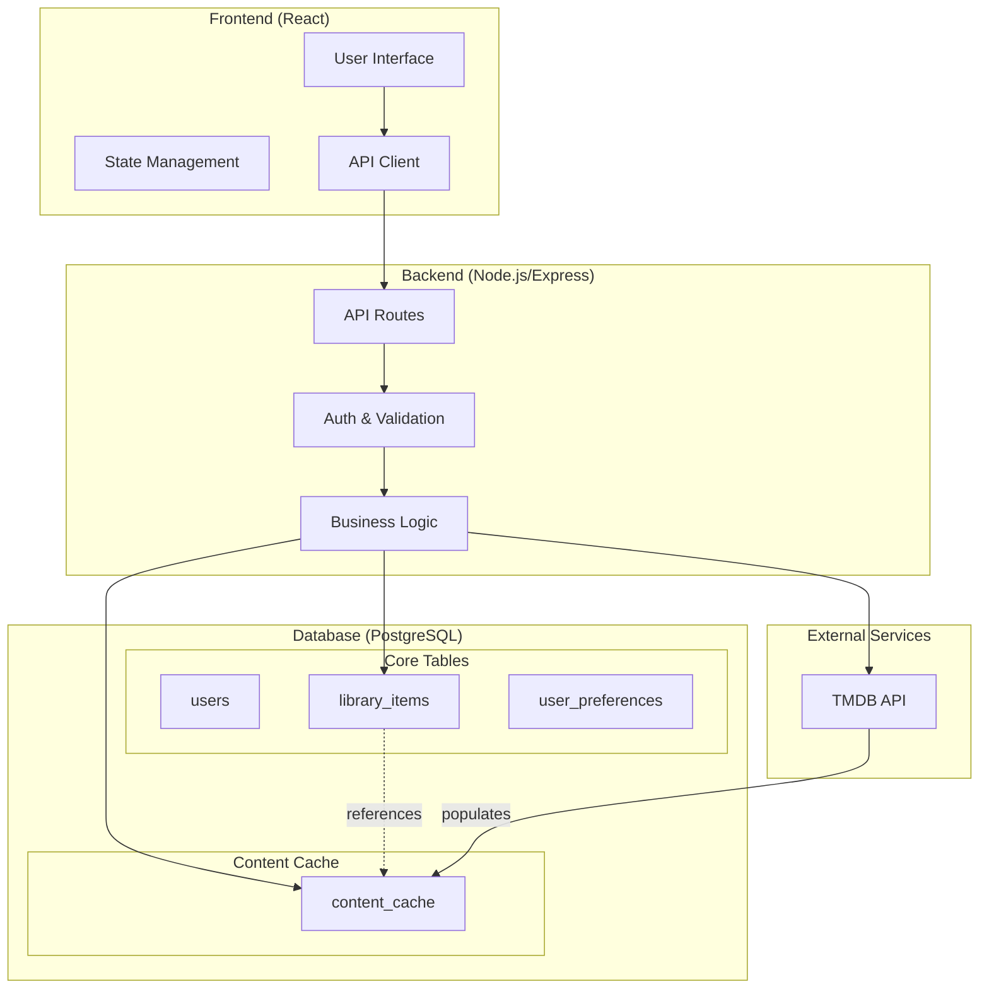
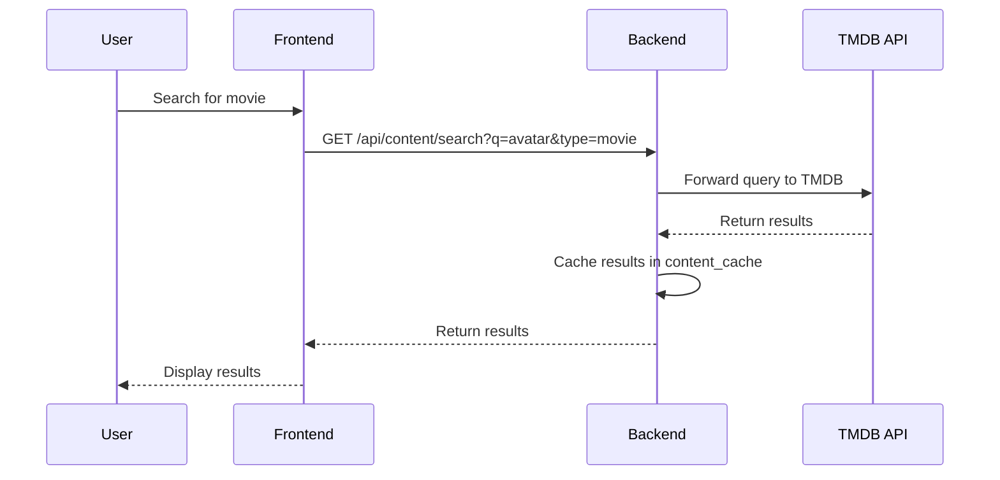
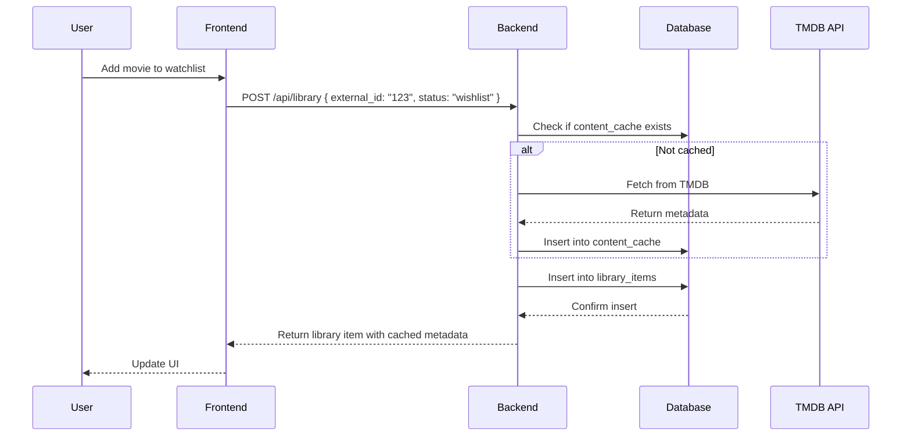
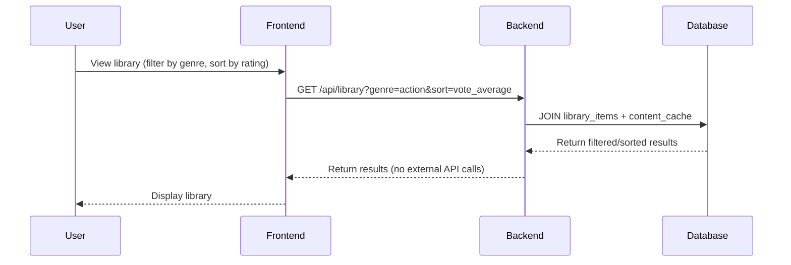
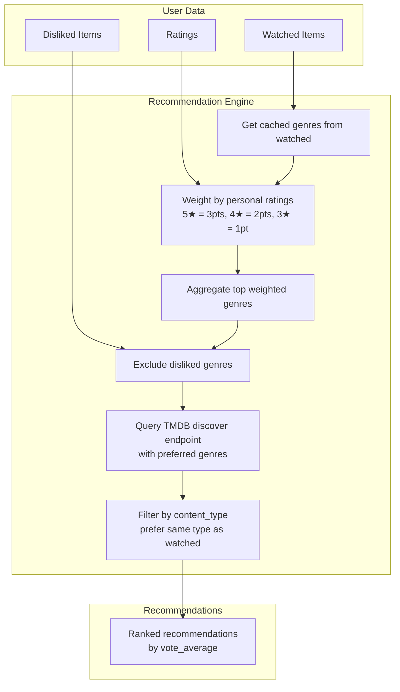

# ShowFreak - Technical Architecture

## Overview

ShowFreak is a full-stack web application for discovering, tracking, and receiving recommendations for movies and TV shows. This document outlines the technical architecture for the MVP.

---

## 1. System Architecture Diagram



---

## 2. System Components

| Component | Technology | Purpose |
|-----------|------------|---------|
| Frontend | React + Vite | User interface and interactions |
| Backend | Node.js + Express | API server and business logic |
| Database | PostgreSQL | Persistent data storage + content cache |
| External APIs | TMDB | Movie & TV show data |
| Authentication | JWT | User session management |

---

## 3. Frontend Architecture

### Structure

```
src/
├── components/       # Reusable UI components
├── pages/            # Route pages (Home, Library, Details, etc.)
├── hooks/            # Custom React hooks
├── services/         # API client functions
├── context/          # React context for global state
├── types/            # TypeScript interfaces
└── utils/            # Helper functions
```

### Key Pages

- **Home** - Featured content and recommendations
- **Search** - Search and browse movies/TV shows
- **Details** - Individual movie/show information
- **Library** - User's watched, favorites, wishlist
- **Preferences** - User dislikes and settings

### State Management

- React Context for user session and global state
- Local component state for UI interactions
- TanStack Query recommended for server state caching

---

## 4. Backend Architecture

### Structure

```
server/
├── routes/           # API endpoint definitions
├── controllers/      # Request handlers
├── services/         # Business logic
├── models/           # Database models
├── middleware/       # Auth, validation, error handling
├── config/          # Environment configuration
└── utils/           # Helper functions
```

### API Endpoints

| Method | Endpoint | Description |
|--------|----------|-------------|
| **Auth** | | |
| POST | /api/auth/register | User registration |
| POST | /api/auth/login | User login |
| GET | /api/auth/me | Get current user |
| **Content** | | |
| GET | /api/content/search | Search external content |
| GET | /api/content/search?type=movie\|tv | Filter by content type |
| GET | /api/content/:id | Get content details |
| GET | /api/content/:id/similar | Get similar content |
| **Library** | | |
| GET | /api/library | Get user's library |
| GET | /api/library?q= | Search by title |
| GET | /api/library?genre= | Filter by genre |
| GET | /api/library?status= | Filter by watched/favorite/wishlist |
| GET | /api/library?sort=release_year\|personal_rating\|vote_average | Sort results |
| POST | /api/library | Add item to library (auto-caches metadata) |
| PATCH | /api/library/:id | Update library item (rating, notes, status) |
| DELETE | /api/library/:id | Remove from library |
| **Preferences** | | |
| GET | /api/preferences | Get user preferences (dislikes) |
| POST | /api/preferences | Add dislike |
| DELETE | /api/preferences/:id | Remove dislike |
| **Recommendations** | | |
| GET | /api/recommendations | Get personalized recommendations |
| GET | /api/recommendations?based_on=:id | Get similar to specific content |

### Query Parameters

All list endpoints support:

| Parameter | Values | Default | Description |
|-----------|--------|---------|-------------|
| page | integer | 1 | Page number |
| limit | integer (max 100) | 20 | Items per page |
| sort | string | created_at | Sort field |
| order | asc \| desc | desc | Sort order |
| q | string | - | Search query (title) |
| genre | string | - | Filter by genre |
| status | watched/favorite/wishlist | - | Filter by status |
| type | movie/tv | - | Filter by content type |

---

## 5. Database Schema

### Entity Relationship Diagram

```mermaid
erDiagram
    USERS ||--o{ LIBRARY_ITEMS : has
    USERS ||--o{ USER_PREFERENCES : has
    LIBRARY_ITEMS }o--|| CONTENT_CACHE : references
    
    USERS {
        uuid id PK
        string email UK
        string password_hash
        string username
        timestamptz created_at
    }
    
    CONTENT_CACHE {
        string external_id PK
        string content_type
        string title
        string poster_path
        decimal vote_average
        integer release_year
        string genres JSONB
        timestamptz cached_at
        timestamptz expires_at
    }
    
    LIBRARY_ITEMS {
        uuid id PK
        uuid user_id FK
        string external_id FK
        string content_type
        string status
        int personal_rating
        text notes
        timestamptz watched_at
        timestamptz created_at
        timestamptz updated_at
    }
    
    USER_PREFERENCES {
        uuid id PK
        uuid user_id FK
        string external_id
        string content_type
        string dislike_reason
        timestamptz created_at
    }
```

### Tables

#### users
| Column | Type | Constraints |
|--------|------|-------------|
| id | UUID | PRIMARY KEY (gen_random_uuid()) |
| email | VARCHAR(255) | UNIQUE, NOT NULL |
| password_hash | VARCHAR(255) | NOT NULL |
| username | VARCHAR(100) | NOT NULL |
| created_at | TIMESTAMPTZ | DEFAULT NOW() |

**Indexes:** `idx_users_email`

#### content_cache
| Column | Type | Constraints |
|--------|------|-------------|
| external_id | VARCHAR(50) | PRIMARY KEY |
| content_type | VARCHAR(20) | NOT NULL (movie/tv) |
| title | VARCHAR(255) | NOT NULL |
| poster_path | VARCHAR(255) | NULL |
| vote_average | DECIMAL(3,1) | NULL (0-10) |
| release_year | INTEGER | NULL |
| genres | JSONB | NOT NULL (array of strings) |
| cached_at | TIMESTAMPTZ | DEFAULT NOW() |
| expires_at | TIMESTAMPTZ | NOT NULL |

**Indexes:** 
- `idx_content_type` (content_type)
- `idx_title` (title) - for text search
- `idx_genres` (genres) - using GIN index for JSONB array

#### library_items
| Column | Type | Constraints |
|--------|------|-------------|
| id | UUID | PRIMARY KEY |
| user_id | UUID | FOREIGN KEY → users.id |
| external_id | VARCHAR(50) | FOREIGN KEY → content_cache.external_id |
| content_type | VARCHAR(20) | NOT NULL (movie/tv) |
| status | VARCHAR(20) | NOT NULL (watched/favorite/wishlist) |
| personal_rating | INTEGER | NULL (1-5) |
| notes | TEXT | NULL |
| watched_at | TIMESTAMPTZ | NULL |
| created_at | TIMESTAMPTZ | DEFAULT NOW() |
| updated_at | TIMESTAMPTZ | DEFAULT NOW() |

**Indexes:** 
- `idx_library_user_status` (user_id, status)
- `idx_library_user_type` (user_id, content_type)
- `UNIQUE(user_id, external_id)` - Prevent duplicates
- Foreign key constraint to content_cache ensures referential integrity

#### user_preferences
| Column | Type | Constraints |
|--------|------|-------------|
| id | UUID | PRIMARY KEY |
| user_id | UUID | FOREIGN KEY → users.id |
| external_id | VARCHAR(50) | NOT NULL |
| content_type | VARCHAR(20) | NOT NULL |
| dislike_reason | VARCHAR(50) | NULL |
| created_at | TIMESTAMPTZ | DEFAULT NOW() |

**Indexes:** `idx_preferences_user` (user_id)

---

## 6. Data Flow

### Search Flow



### Add to Library Flow



### Library Query Flow (No External API)



---

## 7. Library Operations - Query Behavior

All library filtering, sorting, and searching uses **cached data only**:

| Operation | Implementation |
|-----------|----------------|
| Search by title | `JOIN` with content_cache, filter on `title ILIKE %q%` |
| Filter by genre | `JOIN` with content_cache, filter on `genres @> '["action"]'` |
| Sort by external rating | `JOIN` with content_cache, order by `vote_average` |
| Sort by release year | `JOIN` with content_cache, order by `release_year` |
| Sort by personal rating | Order by `personal_rating` |
| Sort by date added | Order by `created_at` |

**PostgreSQL Query Example:**

```sql
SELECT li.*, cc.title, cc.poster_path, cc.vote_average, cc.release_year, cc.genres
FROM library_items li
JOIN content_cache cc ON li.external_id = cc.external_id
WHERE li.user_id = $1
  AND ($2 IS NULL OR li.status = $2)
  AND ($3 IS NULL OR cc.genres @> $3::jsonb)
  AND ($4 IS NULL OR cc.title ILIKE '%' || $4 || '%')
ORDER BY 
  CASE WHEN $5 = 'vote_average' THEN cc.vote_average END DESC,
  CASE WHEN $5 = 'release_year' THEN cc.release_year END DESC,
  CASE WHEN $5 = 'personal_rating' THEN li.personal_rating END DESC,
  li.created_at DESC
```

---

## 8. Recommendation System

### Content-Based Filtering Algorithm



### Recommendation Sources

| Source | Description | Data Used |
|--------|-------------|-----------|
| By Genre Preference | Content matching top genres from rated content | genres, vote_average |
| By Watch History | Similar content to what user watched | external_id → TMDB similar |
| By Specific Content | "Similar to [movie]" feature | external_id → TMDB similar |

### Algorithm Details

1. **Collect watched items** with personal ratings
2. **Extract genres** from content_cache, weight by rating:
   - 5★ = 3 points
   - 4★ = 2 points  
   - 3★ = 1 point
   - Not rated = 0.5 points
3. **Aggregate and sort** genres by total weight
4. **Exclude** genres from user's dislikes (user_preferences)
5. **Query TMDB** discover endpoint with top 3 genres
6. **Filter** by content_type (prefer same type as user's library)
7. **Rank** by vote_average descending
8. **Cache** recommendations for 1 hour

---

## 9. Technology Stack

| Layer | Technology |
|-------|------------|
| Frontend | React 18, Vite, TypeScript, React Router |
| Styling | CSS Modules or Tailwind CSS |
| State | TanStack Query |
| Backend | Node.js, Express, TypeScript |
| Database | PostgreSQL |
| ORM | Prisma |
| Auth | JWT (jsonwebtoken) + bcrypt |
| External Data | TMDB API |

---

## 10. MVP Scope Notes

- Single user account per person
- No social features
- Content-based recommendation algorithm (no ML)
- No real-time notifications
- No admin dashboard
- All metadata cached in PostgreSQL content_cache table

---

*Last Updated: March 2026*
